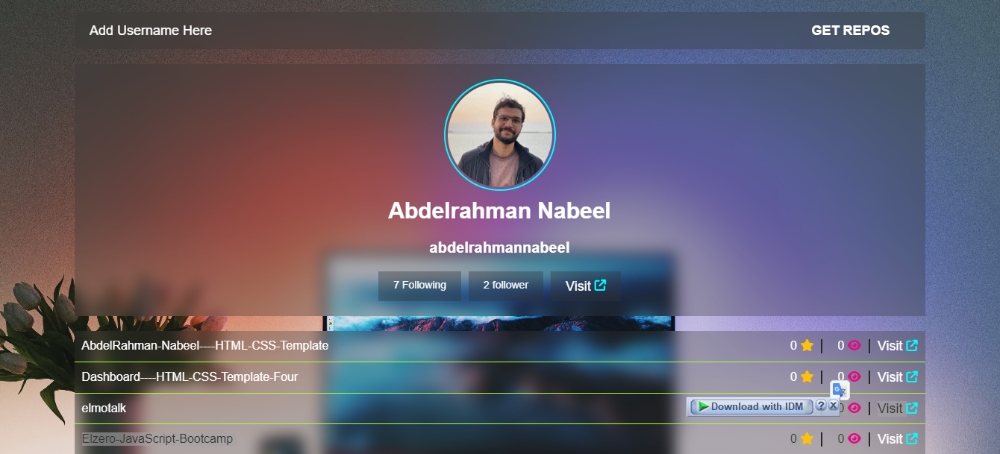

# Get GitHub Repositories With Fetch API

## Project Live Reviwe
- [Live Review]( https://abdelrahmannabeel.github.io/Get-Repos/)
## About The project
- Get GitHub Repositories Using Fetch API By GitHub Username and Browse Them.
## Tools
- HTML
- CSS
- JavaScript
## My Accounts
- LinkedIn - [@abdelrahman-nabeel](https://www.linkedin.com/in/abdelrahman-nabeel/)
- GitHub - [@abdelrahmannabeel](https://github.com/abdelrahmannabeel)
- CodePen - [@Abdelrahman-nabeel](https://codepen.io/Abdelrahman-nabeel)
- Frontend Mentor - [@abdelrahmannabeel](https://www.frontendmentor.io/profile/abdelrahmannabeel)
